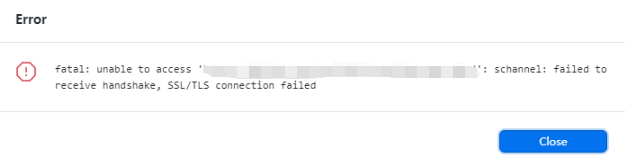

# 问题

## OpenSSL SSL_read: Connection was reset, errno 10054

### 解决办法

* 打开Git Bash，CD到指定目录

* 如果说是SSL证书问题，那么，按如下代码解除SSL验证

```cmake
git config --global http.sslVerify "false"
```

* 重新执行 git clone --recursive https://github.com/chromiumembedded/cef.git 命令，但依旧无法下载。

* 如果上述指令无法解决你的问题，可以执行如下指令：

  ```cmake
  git config --global https.sslVerify "false"
  ```

* 再重新执行克隆命令，即可解决了我的问题，如下图所示：

  

## 问题

### Updates were rejected because a pushed branch tip is behind its remote

### 解决办法

```
git pull #先执行pull
git push origin dev  #推送到远端dev分支
```

---

`git stash`：备份当前工作区内容，从最近的一次提交中读取相关内容，让工作区保证和上次提交的内容一致。同时，将当前工作区内容保存到Git栈中
`git pull`：拉取服务器上当前分支代码
`git stash pop`：从Git栈中读取最近一次保存的内容，恢复工作区相关内容。同时，用户可能进行多次stash操作，需要保证后stash的最先被取到，所以用栈（先进后出）来管理；pop取栈顶的内容并恢复
`git stash list`：显示Git栈内的所有备份，可以利用这个列表来决定从那个地方恢复。
`git stash clear`：清空Git栈

---

## 问题

### schannel: failed to receive handshake, SSL/TLS connection failed



### 解决办法

#### 方法一

在C盘个人用户中找到.gitconfig文件，设置或修改以下内容，然后解决

```
[http]
    sslbackend = openssl
```

#### 方法二

打开Git Base Here，输入下面的命令，回车即可

```
git config --global http.sslBackend "openssl"
```

