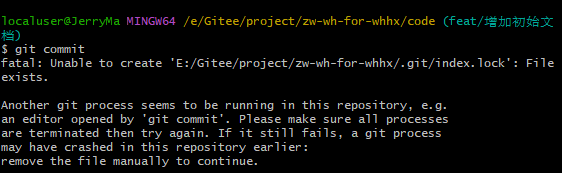

# 问题



## 原因分析

```
1.误操作比如(git commit) 直接提交 导致检索不到要保存的信息他就会锁定当前的文件

2.git下的index.lock文件，在进行某些比较费时的git操作时自动生成，操作结束后自动删除，相当于一个锁定文件，目的在于防止对一个目录同时进行多个操作。有时强制关闭进行中的git操作，这个文件没有被自动删除，之后就无法进行其他git操作，必须手动删除。
```

### 解决方法

#### 方法一

```cmake
找到.git/index.lock文件，直接删除即可； 如果在linux上的话，执行rm删除命令：
rm -f .git/index.lock
```

#### 方法二

**执行git命令**

```cmake
git clean -f .git/index.lock
```

# Please make sure you have the correct access rights and the repository exists

**1. 重新在git设置一下身份的名字和邮箱**

* cmd|powershell| bash进入要提交的目录下，然后

```lua
git config --global user.name "yourname"
git config --global user.email "your@email.com"

```

* **删除.ssh文件夹（直接搜索该文件夹）下的known_hosts，删除。**

.ssh文件在C盘里面的。把known_hosts删除。

* ssh-keygen -t rsa -C "your@email.com"（请填你设置的邮箱地址）

就像这样，然后一直回车就行了

* 重新在github上设置SSH key