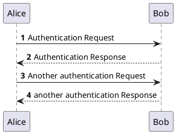
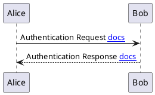

## 安装docsify

* 先安装nodejs

* 安装docsify工具

    ```bash
    npm i docsify-cli -g
    ```

* 初始化目录

    ```
    docsify init <path> [--local false] [--theme vue] [--plugins false]
    
    # docsify i <path> [-l false] [-t vue] [--plugins false]
    ```
    
    `<path>`默认为当前目录。使用`./docs`（或`docs`）之类的相对路径。
    
    * local选项：
      * 速记：`-l`
      * 类型：布尔值
      * 默认：`false`
      * 说明：将文件复制`docsify`到文档路径，默认值是`false`用来使用cdn.jsdelivr.net<内容分发网络（CDN）>。要显式设置此选项以使用`--no-local`。
    
    * theme选项：
      * 速记：`-t`
      * 类型：字符串
      * 默认：`vue`
      * 说明：选择一个主题，默认为`vue`，其他选项为`buble`，`dark`和`pure`。
    
    * plugins选项：
      * 速记：`-p`
      * 类型：布尔值
      * 默认：`false`
      * 描述：提供插件列表作为`<script>`标签插入到`index.html`.
    
    ```bash
    docsify init ./docs
    ```

* serve命令

  `localhost`使用 livereload运行服务器。

  

  ```bash
  docsify serve <path> [--open false] [--port 3000]
  
  # docsify s <path> [-o false] [-p 3000]
  ```

  * open选项：
    * 速记：`-o`
    * 类型：布尔值
    * 默认：`false`
    * 说明：在默认浏览器中打开文档，默认为`false`. 要显式设置此选项以`false`使用`--no-open`.

  * port选项：
    * 速记：`-p`
    * 类型：数字
    * 默认：`3000`
    * 说明：选择监听端口，默认为`3000`.

* Docsify 的生成器。

    ```bash
    docsify generate <path> [--sidebar _sidebar.md]

    # docsify g <path> [-s _sidebar.md]
    ```

    * sidebar选项：
      * 速记：`-s`
      * 类型：字符串
      * 默认：`_sidebar.md`
      * 说明：生成侧边栏文件，默认为`_sidebar.md`.


## 插件设置

### 设置配色


```html
<script>
    .markdown-section strong {
		  color: rgb(239, 112, 96);
		}

	.markdown-section code {
      border-radius: 2px;
      font-family: "Helvetica Neue",Helvetica,"Hiragino Sans GB","Microsoft YaHei",Arial,sans-serif;
      font-size: 16px !important;
      margin: 0 2px;
      padding: 3px 5px;
      white-space: nowrap;
      /*border: 1px solid #282c34;*/
      /*color: rgb(184, 101, 208);*/
    }
	.markdown-section > div > img, .markdown-section pre {
      box-shadow: 2px 2px 20px 6px rgb(255, 255, 255) !important;
    }

    .markdown-section a:not(:hover) {
      text-decoration: none;
    }
	#main h2 span{ color:#18b566 !important; }
    #main h3 span{ color:#089acc !important; }
    #main h4 span{ color:#FF9700 !important; }
	p code{
      background-color: rgb(255, 255, 255) !important;
    }
	
	/*添加代码块复制按钮样式*/
    .docsify-copy-code-button {
      background: #00a1d6 !important;
      color: #FFFFFF !important;
      font-size: 13px !important;
    }
	
	::after{
      color: #9da2fd !important;
      font-size: 13px !important;
    }
    .markdown-section>p {
      font-size: 16px !important;
    }


    /*代码块头部图标 start*/
    .markdown-section pre:before {
      content: '';
      display: block;
      background: url(_media/codeHeader.png);
      height: 30px;
      background-size: 40px;
      background-repeat: no-repeat;
      background-color: #1C1C1C;
      background-position: 10px 10px;
    }
    /*代码块头部图标 end*/

    .markdown-section pre>code {
      color: #c0c3c1;
      font-family: 'Inconsolata', consolas,"PingFang SC", "Microsoft YaHei", monospace;
      background-color: #212121;
      font-size: 15px;
      white-space: pre;
      line-height: 1.5;
      -moz-tab-size: 4;
      -o-tab-size: 4;
      tab-size: 4;
    }

    @media (max-width:600px) {
      pre {
        padding-left: 3px !important;
        padding-right: 3px !important;
        margin-left: -20px !important;
        margin-right: -20px !important;
        box-shadow: 0px 0px 20px 0px #f7f7f7 !important;
      }

      /*代码块复制按钮默认隐藏*/
      .docsify-copy-code-button {
        display: none;
      }

      .advertisement{
        display: none;
      }

    }

	.token.keyword{
      color: #f92672 !important;
    }

    .token.comment{
      color: #75715e !important;
    }

    .token.tag{
      color: #a589ad !important;
    }

    .token.attr-name{
      color: #de916c !important;
    }

    .token.attr-value{
      color: #4faee2 !important;
    }

    .token.macro.property{
      color: #4faee2 !important;
    }

    .token.function{
      color: #66D9EF !important;
    }
    .token.string{
      color: #e6db74 !important;
    }
    .token.punctuation{
      color: #c0c3c1 !important;
    }

    .token.number{
      color: #ae81ff  !important;
    }
    .token.operator{
      color: #f92672 !important;
    }
    .token.builtin{
      color: #66D9EF !important;
    }
    .token.decorator.annotation.punctuation
    {
      color: #a6e22e !important;
    }

    .token.class-name{
      color: #a6e22e !important;
    }

    .token.namespace{
      color: #f92672 !important;
    }

    .token.property{
      color: #f92672 !important;
    }

    .token.parameter{
      color: #f92672 !important;
    }

    .token.variable{
      color: #f92672 !important;
    }

    .token.namespace{
      color: #ededed !important;
    }
</script>
```

```html
<script src="assets/js/docsify-copy-code.min.js"></script>
<script src="assets/js/docsify-tabs.min.js"></script>
<script src="assets/js/docsify-themeable.min.js"></script>
<script src="assets/js/prism-line-numbers.min.js"></script>
<script src="assets/js/docsify-sidebar-collapse.min.js"></script>
<script src="assets/js/search.js"></script>
<script src="assets/js/docsify.min.js"></script>
<script src="assets/js/emoji.min.js"></script>
<script src="assets/js/zoom-image.min.js"></script>
<script src="assets/js/prism-autoloader.min.js"></script>
<script src="assets/js/prism-autoloader.js"></script>
<script src="assets/js/prism-javascript.js"></script>
<script src="assets/js/prism-php.js"></script>
<script src="assets/js/prism-bash.js"></script>
<script src="assets/js/prism-c.js"></script>
<script src="assets/js/prism-cpp.js"></script>
<script src="assets/js/prism-python.js"></script>
<script src="assets/js/prism-go.js"></script>
<script src="assets/js/prism-java.js"></script>
<script src="assets/js/prism-sql.js"></script>
<script src="assets/js/prism-markup.js"></script>
<script src="assets/js/prism-yaml.js"></script>
<script src="assets/js/prism-json.js"></script>
<script src="assets/js/prism-docker.js"></script>
<script src="assets/js/prism-git.js"></script>
<script src="assets/js/prism-dart.js"></script>
<script src="assets/js/prism-ini.js"></script>
<script src="assets/js/prism-nginx.js"></script>
<script src="assets/js/prism-css.js"></script>
<script src="assets/js/prism-http.js"></script>
<script src="assets/js/prism-latex.js"></script>
<script src="assets/js/prism-markdown.js"></script>
<script src="assets/js/prism-matlab.js"></script>
<script src="assets/js/prism-powershell.js"></script>
<script src="assets/js/prism-c++.js"></script>
<script src="assets/js/prism-csharp.js"></script>
```

### 出现两个搜索框

* 隐藏第一个input框就好

```xml
<style>
.sidebar .search:nth-child(1){
  display: none;
}
</style>
```

插件的问题直接去

https://docsify.js.org/#/awesome?id=plugins 查询

### 美化提示样式

[Docsify-alerts](https://github.com/fzankl/docsify-plugin-flexible-alerts)

<!-- Latest -->

> [!NOTE]
> An alert of type 'note' using global style 'callout'.


> [!NOTE|style:flat]
> An alert of type 'note' using alert specific style 'flat' which overrides global style 'callout'.

As you can see in the second snippet, output can be configured on alert level also. Supported options are listed in following table:

| Key             | Allowed value                                           |
| --------------- | ------------------------------------------------------- |
| style           | One of follwowing values: callout, flat                 |
| label           | Any text                                                |
| icon            | A valid Font Awesome icon, e.g. 'fas fa-comment'        |
| className       | A name of a CSS class which specifies the look and feel |
| labelVisibility | One of follwowing values: visible (default), hidden     |
| iconVisibility  | One of follwowing values: visible (default), hidden     |

> [!TIP|style:flat|label:My own heading|iconVisibility:hidden]
> An alert of type 'tip' using alert specific style 'flat' which overrides global style 'callout'.
> In addition, this alert uses an own heading and hides specific icon.

As mentioned above you can provide your own alert types. Therefore, you have to provide the type configuration via `index.html`. Following example shows an additional type `COMMENT`.
```html
<script>
  window.$docsify = {
    'flexible-alerts': {
      comment: {
        label: 'Comment',

        // localization
        label: {
          '/en-GB/': 'Comment',
          '/': 'Kommentar'
        },
    
        // Assuming that we use Font Awesome
        icon: 'fas fa-comment',
        className: 'note'
      }
    }
  };
</script>

```

> [!COMMENT]
> An alert of type 'comment' using style 'callout' with default settings.


### docsify-plantuml

[docsify-plantuml](https://github.com/imyelo/docsify-plantuml)
```html
<script>
window.$docsify = {
  plantuml: {
    skin: 'default',
  },
}
</script>

<script src="//unpkg.com/docsify-plantuml/dist/docsify-plantuml.min.js"></script>
```

* 怎么用





## 徽章查询服务

[徽章](badgen.net)

[自定义徽章](img.shields.io)